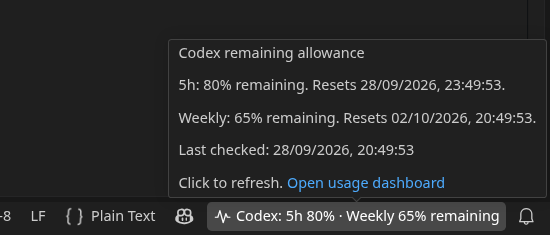

# Codex Usage Status


[](https://www.gnu.org/licenses/gpl-3.0)

A VS Code extension that shows your remaining Codex allowance in the status bar. Hover over it to see reset times and the last successful check, or click it to refresh.



Screenshot with sample allowance values.

The extension reads account rate limits through a local `codex app-server` process. It displays the allowance windows returned for your account, including separate limit names when more than one is available.

## Prerequisites

- VS Code 1.85.0 or later.
- A Codex executable, either bundled with the installed OpenAI extension or available as `codex` on your `PATH`. You can also configure an absolute path.
- Codex signed in with your ChatGPT account, with allowance data available for that account.

## Installation

Install a packaged `.vsix` file through **Extensions: Install from VSIX...** in the VS Code Command Palette. To run the extension from this repository, follow the development instructions below.

The extension starts after VS Code finishes loading and checks usage immediately.

## Usage

The status bar shows the percentage remaining for each allowance window. For example, an account with five-hour and weekly windows might show:

```text
Codex: 5h 80% · Weekly 65% remaining
```

The tooltip shows reset times and the last successful check in your local time zone, using your system's default date and time format.

- Click the status bar item or run **Codex Usage: Refresh** to check again.
- Run **Codex Usage: Open Usage Dashboard**, or use the tooltip link, to open the account usage page.
- The item gets a warning background when any window reaches the configured remaining-allowance threshold.
- Previous values stay visible with a `stale` label if a refresh fails, more than two refresh intervals have elapsed since the last success, or a reported reset time has passed.

## Settings

Search for `Codex Usage` in VS Code Settings, or edit these values in your user `settings.json`:

| Setting | Default | Description |
| --- | --- | --- |
| `codexUsage.executablePath` | `""` | Absolute path to the Codex executable. When empty, the extension checks the installed OpenAI extension's bundled executable, then tries `codex` on `PATH`. |
| `codexUsage.refreshIntervalSeconds` | `60` | Seconds between checks. The setting accepts 30 to 3600. |
| `codexUsage.warningThresholdPercent` | `20` | Highlight the status bar when any window has this percentage remaining or less. Accepts 0 to 100. |

Changing a setting restarts the connection and triggers a new check.

## Troubleshooting

If the status bar shows `Codex: unavailable`, hover over it for the error.

- If the executable cannot be found, install Codex or set `codexUsage.executablePath` to its absolute path. Relative paths are rejected.
- If the account returns no allowance windows, check that Codex is signed in with your ChatGPT account and that the account has usage data available.
- If a request times out or the app server stops, click to retry. The extension also retries at the next scheduled check.

A stale value is the result of an earlier successful check. Refresh it before relying on the displayed allowance.

## Development

Use Node.js with support for `node --test` to run the tests, and Python 3 to build a VSIX. The project has no npm dependencies to install.

1. Open this repository in VS Code.
2. Press **F5** with the **Run Codex Usage Status** launch configuration selected.
3. Check the status bar in the Extension Development Host window.

Run the client and usage-formatting tests with:

```sh
npm test
```

The packaging command is:

```sh
npm run package
```

It writes `dist/codex-usage-status-<version>.vsix` using the version in `package.json`.

## Contributing

Open an issue to discuss proposed changes before submitting a pull request. Use Conventional Commits and follow the [contributing guide](.github/CONTRIBUTING.md) for branching, commits, pull requests, and code style.

## Licence

This project is licensed under the GNU General Public License v3.0. See [LICENCE](LICENCE) for details.
